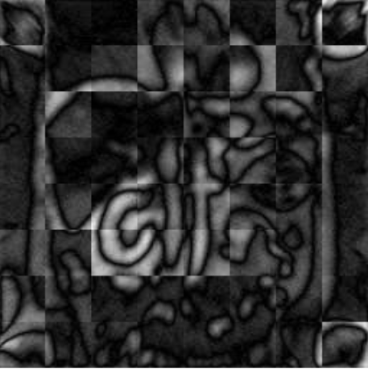
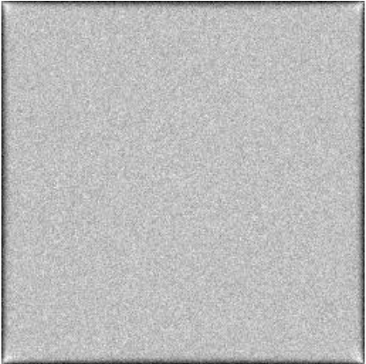
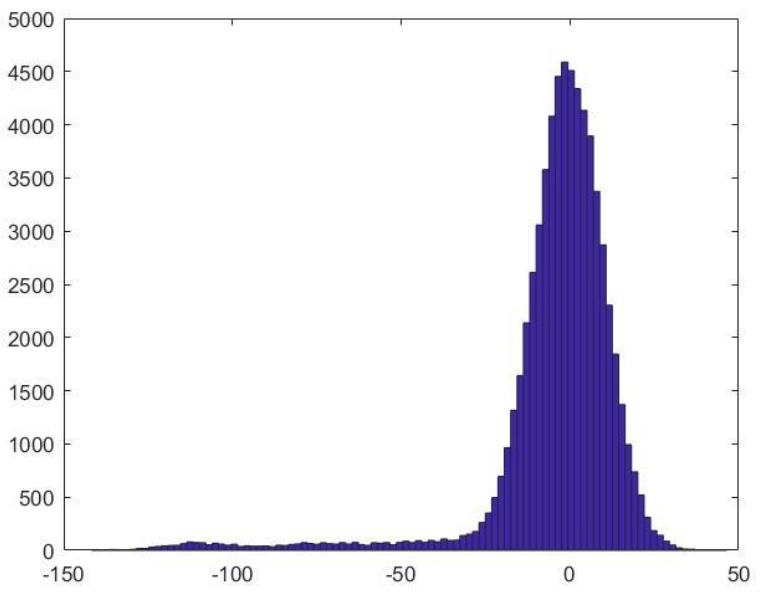
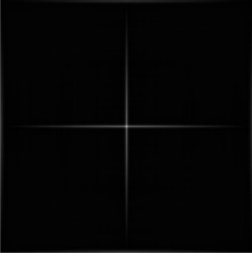

# Medical Image Restoration

This project was centered around a problem where I was given just an image that was degraded by a system with unknown characteristics. The goal of the project was to restore the image to be as similar to the original image as possible. In this project, I characterized the system's deterministic and noise properties. After these properties were determined, restoration algorithms were considered and one path was chosen to apply to the image. 

In summary, the system was linear, shift-variant with stationary Gaussian white noise (uncorrelated noise, of course). From the various tests outlined in FinalExam.m, I came to the verdict that the system was linear, shift-variant with stationary, Poisson-distributed, correlated noise. 

I created an algorithm consisting of tiling sub-images, custom Fourier filtering, and MAP restoration. The result is below. Obviously this is not the true image. While it is a disappointing outcome, I learned a lot from the project that put me in a real life setting. In retrospection of the project, I realized I overlooked something minor when characterizing the properties of the system. This mistake led to a great limitation in the algorithms I could consider, which led to the algorithm I decided on which led to this poor restoration.

For a full explanation of the project, please see the report in "Report.pdf". The next section in this README is an explanation of the mistake that is not found in the report. 

## Mis-diagnosis of System Properties

The choice of Poisson and correlated noise can be traced to a mistake I made with assumptions. Here is the output of the system when an input image of constant intensity is provided to the system. 

I took this output image and subtracted it from the input image to get an image with just the noise in it. This rationale was almost correct; I made the wrong assumption that the resulting image just had noise because many operations (such as blur, derivative, etc.) have no affect on a constant intensity image like the one we used as input. There were other things (notch frequencies for example) that can cause this assumption to be false, however I had not seen any in the tests up to that point. However, the black edges in the output image were evidence of something that would cause that assumption to be false. I am not quite sure of the exact cause of these black edges, although I could speculate. Anyway, I should have been a little more careful when using the noise image for future steps. 

This noise image was still viable for use, I would have just needed to be a little more careful in analyzing the following plots. 

The histogram below of the noise image was used to get the distribution of the noise. The shape of the histogram appears Poisson, however when you take into account that the black edges of the output image aren't due to noise you can actually ignore the tail of the distribution because these points are due to the black edges. 

The autocorrelation of the noise image was taken and plotted. Theoretically, to be white noise, this autocorrelation image should just be a single impulse centered in the middle of the image. However, we see a cross-shape (see below). Since the shape was not a single impulse, I said the noise was correlated in the x and y directions. This correlation is due to the black edges in the noise image. 

These mischaracterizations of the noise restricted what methods I could use in the solution since I came to the conclusion that the system was shift-variant with poisson-distributed and correlated noise. 